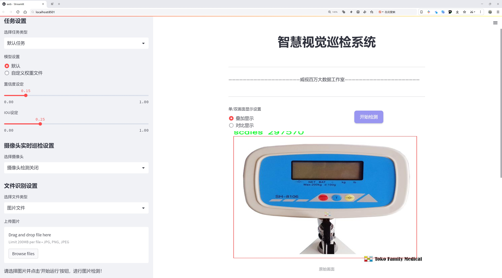
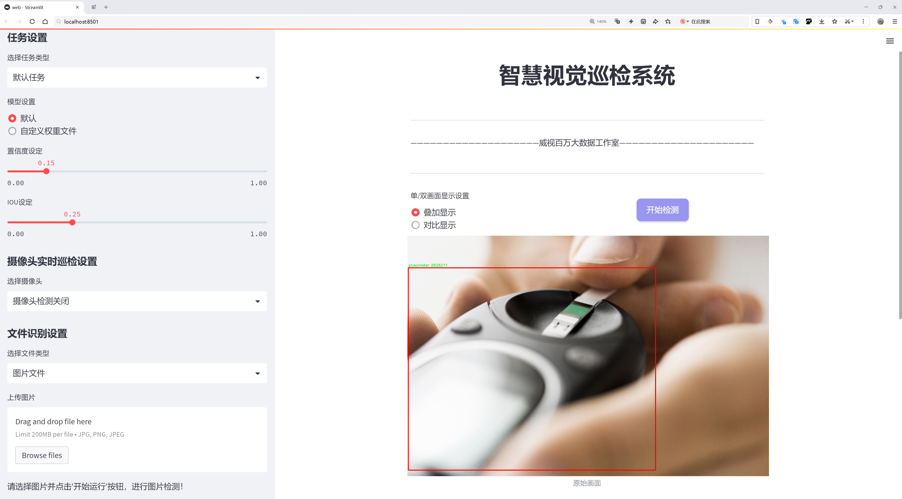
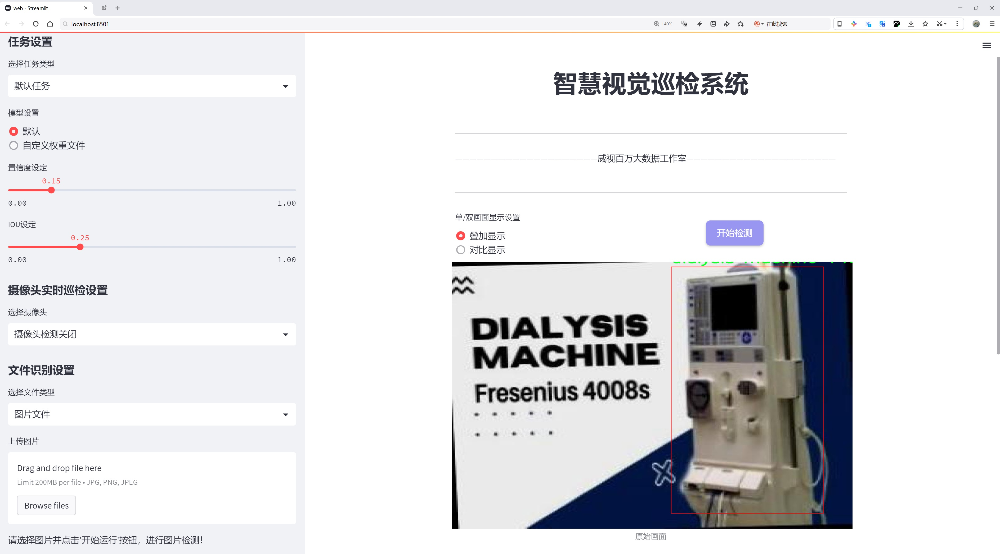
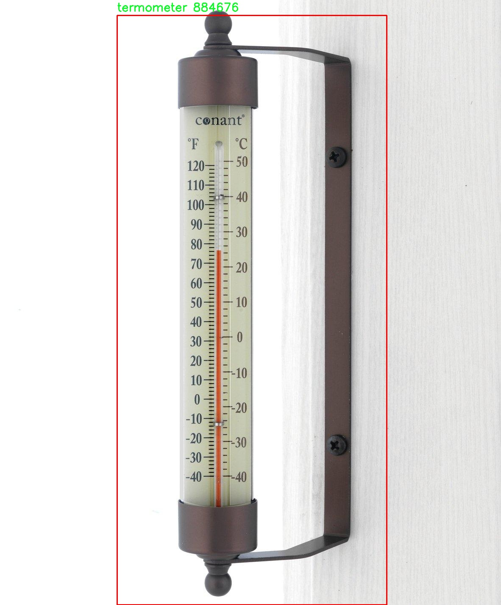
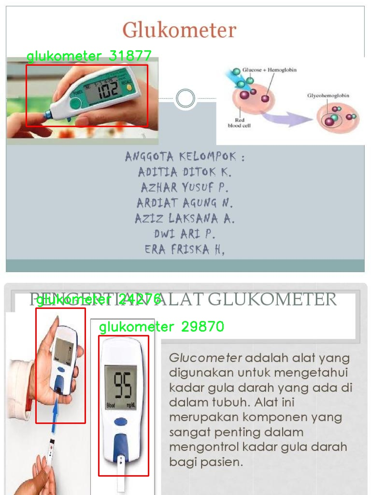
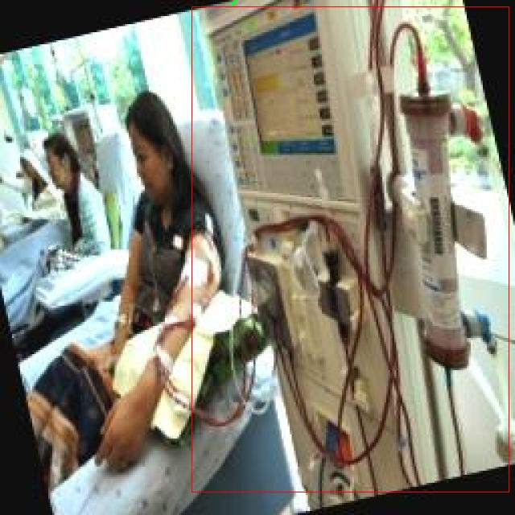
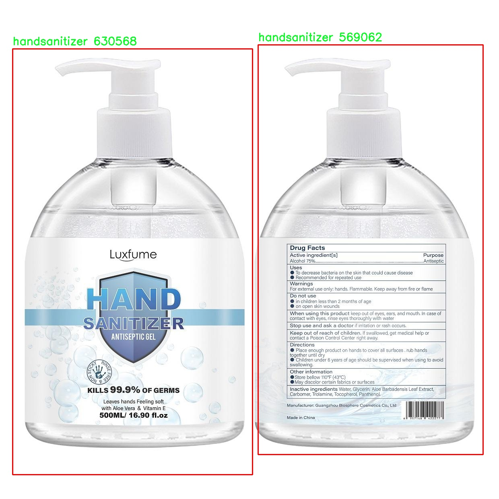

# 医疗设备检测检测系统源码分享
 # [一条龙教学YOLOV8标注好的数据集一键训练_70+全套改进创新点发刊_Web前端展示]

### 1.研究背景与意义

项目参考[AAAI Association for the Advancement of Artificial Intelligence](https://gitee.com/qunmasj/projects)

项目来源[AACV Association for the Advancement of Computer Vision](https://kdocs.cn/l/cszuIiCKVNis)

研究背景与意义

随着全球医疗技术的不断进步，医疗设备的种类和数量日益增加，这为医疗服务的高效性和安全性提供了保障。然而，医疗设备的多样性也带来了管理和监控的挑战，尤其是在设备的实时检测和维护方面。传统的人工检测方法不仅耗时耗力，而且容易出现遗漏，无法满足现代医疗环境对设备管理的高效需求。因此，基于计算机视觉和深度学习技术的自动化检测系统应运而生，成为提升医疗设备管理效率的重要手段。

在众多深度学习模型中，YOLO（You Only Look Once）系列因其高效的实时目标检测能力而备受关注。YOLOv8作为该系列的最新版本，结合了更为先进的网络结构和算法优化，具备了更高的检测精度和速度。通过对YOLOv8进行改进，能够进一步提升其在医疗设备检测中的应用效果。具体而言，改进的YOLOv8模型可以更好地适应医疗环境中复杂的背景和多样的设备形态，提高对医疗设备的识别率和定位精度。

本研究所使用的数据集包含1900张图像，涵盖17类医疗设备，包括CT扫描仪、医院病床、呼吸机、透析机等。这些设备在医疗服务中扮演着至关重要的角色，及时、准确地检测和识别这些设备不仅有助于提高医疗服务的效率，还能在紧急情况下确保设备的正常运转。通过对这些设备进行有效的监控和管理，可以大幅度降低设备故障带来的风险，提升患者的安全性和治疗效果。

此外，随着人工智能技术的不断发展，基于深度学习的医疗设备检测系统不仅能够实现设备的自动识别，还能够与医院信息管理系统进行有效集成，形成一个智能化的医疗设备管理平台。这一平台可以实时监控设备的使用状态，及时预警设备故障，优化设备的使用效率，从而提升整个医疗机构的运营效率。

综上所述，基于改进YOLOv8的医疗设备检测系统具有重要的研究背景和现实意义。它不仅为医疗设备的管理提供了新的思路和方法，还为实现智能医疗、提升医疗服务质量奠定了基础。通过本研究的深入探索，期望能够为医疗行业提供一个高效、可靠的设备检测解决方案，推动医疗设备管理的智能化进程，为患者的健康保驾护航。

### 2.图片演示







##### 注意：由于此博客编辑较早，上面“2.图片演示”和“3.视频演示”展示的系统图片或者视频可能为老版本，新版本在老版本的基础上升级如下：（实际效果以升级的新版本为准）

  （1）适配了YOLOV8的“目标检测”模型和“实例分割”模型，通过加载相应的权重（.pt）文件即可自适应加载模型。

  （2）支持“图片识别”、“视频识别”、“摄像头实时识别”三种识别模式。

  （3）支持“图片识别”、“视频识别”、“摄像头实时识别”三种识别结果保存导出，解决手动导出（容易卡顿出现爆内存）存在的问题，识别完自动保存结果并导出到tempDir中。

  （4）支持Web前端系统中的标题、背景图等自定义修改，后面提供修改教程。

  另外本项目提供训练的数据集和训练教程,暂不提供权重文件（best.pt）,需要您按照教程进行训练后实现图片演示和Web前端界面演示的效果。

### 3.视频演示

[3.1 视频演示](https://www.bilibili.com/video/BV1XQtmeDETX/)

### 4.数据集信息展示

##### 4.1 本项目数据集详细数据（类别数＆类别名）

nc: 17
names: ['CT-SCAN', 'Hospital Bed', 'Hospital Ventilator', 'Peripheral Magnetic Stimulation -PMS-', 'Ventilator Mask', 'X-ray', 'defibrillator', 'dialysis machine', 'glukometer', 'handsanitizer', 'insulin', 'mask', 'ointment', 'scales', 'stetoskop', 'tensimeter', 'termometer']


##### 4.2 本项目数据集信息介绍

数据集信息展示

在本研究中，我们使用了名为“object-detection aseto”的数据集，以训练和改进YOLOv8的医疗设备检测系统。该数据集专门设计用于医疗领域，涵盖了17种不同类别的医疗设备，旨在提高计算机视觉算法在医疗环境中的应用效果。通过对这些设备的有效检测和识别，我们期望能够提升医疗服务的效率和安全性。

数据集中包含的类别包括CT扫描仪、医院病床、医院呼吸机、外周磁刺激设备（PMS）、呼吸机面罩、X光机、除颤器、透析机、血糖仪、洗手液、胰岛素、口罩、药膏、秤、听诊器、血压计和温度计。这些设备在现代医疗实践中扮演着至关重要的角色，涵盖了从基础护理到复杂治疗的各个方面。

CT扫描仪是现代医学影像学的重要工具，能够提供高分辨率的内部结构图像，帮助医生进行诊断。医院病床则是患者在住院期间接受治疗和护理的基本设施，其数量和分布直接影响医院的接收能力和患者的舒适度。医院呼吸机和呼吸机面罩则是危重病人救治中不可或缺的设备，尤其在疫情期间，其重要性愈加凸显。

此外，外周磁刺激设备（PMS）在神经康复领域的应用日益广泛，能够有效促进患者的康复进程。X光机作为一种常见的影像学检查工具，广泛应用于骨折和其他病变的诊断。除颤器则是心脏骤停患者的生命救助设备，其快速有效的使用能够显著提高患者的生存率。

透析机和血糖仪在慢性病管理中发挥着重要作用，前者用于肾功能不全患者的治疗，后者则是糖尿病患者日常监测血糖水平的必备工具。洗手液、口罩和药膏等设备则是医院感染控制和日常护理中不可或缺的组成部分，能够有效预防交叉感染和促进伤口愈合。

秤、听诊器、血压计和温度计等基础医疗设备，虽然在技术上相对简单，但在日常护理和健康监测中却发挥着不可替代的作用。它们不仅是医疗工作者进行常规检查的工具，也是患者健康管理的重要组成部分。

通过对“object-detection aseto”数据集的深入分析和应用，我们希望能够训练出更为精准和高效的YOLOv8模型，从而在医疗环境中实现更为智能化的设备检测。这将有助于提高医疗服务的自动化水平，减少人为错误，并为医疗工作者提供更为可靠的决策支持。随着数据集的不断丰富和模型的不断优化，我们相信未来的医疗设备检测系统将能够在更广泛的场景中发挥作用，为患者提供更安全、更高效的医疗服务。










### 5.全套项目环境部署视频教程（零基础手把手教学）

[5.1 环境部署教程链接（零基础手把手教学）](https://www.ixigua.com/7404473917358506534?logTag=c807d0cbc21c0ef59de5)


[5.2 安装Python虚拟环境创建和依赖库安装视频教程链接（零基础手把手教学）](https://www.ixigua.com/7404474678003106304?logTag=1f1041108cd1f708b01a)

### 6.手把手YOLOV8训练视频教程（零基础小白有手就能学会）

[6.1 手把手YOLOV8训练视频教程（零基础小白有手就能学会）](https://www.ixigua.com/7404477157818401292?logTag=d31a2dfd1983c9668658)

### 7.70+种全套YOLOV8创新点代码加载调参视频教程（一键加载写好的改进模型的配置文件）

[7.1 70+种全套YOLOV8创新点代码加载调参视频教程（一键加载写好的改进模型的配置文件）](https://www.ixigua.com/7404478314661806627?logTag=29066f8288e3f4eea3a4)

### 8.70+种全套YOLOV8创新点原理讲解（非科班也可以轻松写刊发刊，V10版本正在科研待更新）

由于篇幅限制，每个创新点的具体原理讲解就不一一展开，具体见下列网址中的创新点对应子项目的技术原理博客网址【Blog】：


[8.1 70+种全套YOLOV8创新点原理讲解链接](https://gitee.com/qunmasj/good)

### 9.系统功能展示（检测对象为举例，实际内容以本项目数据集为准）

图9.1.系统支持检测结果表格显示

  图9.2.系统支持置信度和IOU阈值手动调节

  图9.3.系统支持自定义加载权重文件best.pt(需要你通过步骤5中训练获得)

  图9.4.系统支持摄像头实时识别

  图9.5.系统支持图片识别

  图9.6.系统支持视频识别

  图9.7.系统支持识别结果文件自动保存

  图9.8.系统支持Excel导出检测结果数据


### 10.原始YOLOV8算法原理

原始YOLOv8算法原理

YOLOv8算法是目标检测领域的一项重要进展，作为YOLO系列的最新版本，它在原有YOLO模型的基础上进行了多项创新和改进，旨在提升目标检测的准确性和速度。YOLOv8s模型的架构主要由三个部分组成：Backbone、Neck和Head，这些部分协同工作，确保模型能够高效地处理输入图像并生成准确的检测结果。

在Backbone部分，YOLOv8s采用了CSPDarknet（Cross Stage Partial Darknet）网络结构，这一结构通过将网络分为两个部分并引入多个残差块，有效地增强了特征提取的能力。相较于前代模型YOLOv5，YOLOv8s使用了C2f模块替代了C3模块，C2f模块的设计使得输入特征图被分为两个分支，每个分支经过卷积层进行降维处理。这种分支结构不仅提高了特征图的维度，还通过堆叠多个v8_C2fBottleneck层，进一步丰富了模型的特征表示能力。通过这种方式，YOLOv8s能够更好地捕捉到输入图像中的复杂特征，从而为后续的目标检测奠定了坚实的基础。

此外，YOLOv8s还引入了快速空间金字塔池化（SPPF）结构，以便在不同尺度上提取特征。这一结构的设计理念在于通过高效的特征融合，减少模型的参数量和计算量，同时提高特征提取的效率。SPPF模块的引入使得YOLOv8s在处理多尺度目标时，能够更灵活地适应不同大小的物体，增强了模型的鲁棒性。

在Neck部分，YOLOv8s采用了特征金字塔网络（FPN）和路径聚合网络（PAN）的结合。这一结构通过多层卷积和池化操作，对来自Backbone的不同阶段特征图进行融合，从而更好地捕捉不同尺度目标的信息。这种多尺度特征融合技术显著提高了目标检测的性能，使得YOLOv8s在面对复杂场景时，能够更准确地识别和定位目标。

Head部分则负责最终的目标检测和分类任务。YOLOv8s设有三个检测头，分别用于处理不同尺寸的目标信息。每个检测头由一系列卷积层和反卷积层构成，能够有效地将经过Neck处理后的特征图转换为最终的检测结果。值得注意的是，YOLOv8s采用了一种基于无锚框（Anchor-Free）的检测方式，这一创新使得模型能够直接预测目标的中心点和宽高比例，从而减少了对Anchor框的依赖。这种方法不仅提高了检测速度，还在一定程度上提升了检测的准确度，尤其是在复杂背景下的目标识别能力。

YOLOv8s的训练和部署也得到了显著的优化，新的Pytorch训练框架使得自定义模型的训练变得更加方便和高效。模型的灵活性和可扩展性得到了增强，用户可以根据具体需求调整网络结构和参数设置，以适应不同的应用场景。

尽管YOLOv8s在目标检测领域取得了显著的进展，但在一些复杂环境下仍然存在一定的挑战。例如，在复杂水面环境中，由于小目标漂浮物的特征复杂且背景多样，YOLOv8s在定位精度和目标感知能力上可能会出现不足。为了解决这些问题，研究者们提出了YOLOv8-WSSOD算法，通过引入双层路由注意力机制和更小的检测头，进一步提升了模型对小目标的感知能力。

总的来说，YOLOv8算法在特征提取、目标检测和模型训练等多个方面进行了全面的改进，展现出了更高的检测准确度和更快的检测速度。随着目标检测技术的不断发展，YOLOv8及其衍生模型将继续在实际应用中发挥重要作用，推动计算机视觉领域的进一步进步。


### 11.项目核心源码讲解（再也不用担心看不懂代码逻辑）

#### 11.1 70+种YOLOv8算法改进源码大全和调试加载训练教程（非必要）\ultralytics\nn\extra_modules\head.py

以下是对代码中最核心部分的分析和详细注释，主要集中在检测头（Detect Head）相关的类上。

```python
import math
import torch
import torch.nn as nn
from torch.nn.init import constant_, xavier_uniform_

from ..modules import Conv, DFL, Proto
from ultralytics.utils.tal import dist2bbox, make_anchors

class Detect_DyHead(nn.Module):
    """YOLOv8 检测头，使用动态头（DyHead）进行目标检测。"""
    
    def __init__(self, nc=80, hidc=256, block_num=2, ch=()):
        """
        初始化检测头。
        
        参数:
        nc (int): 类别数量。
        hidc (int): 隐藏层通道数。
        block_num (int): 动态头块的数量。
        ch (tuple): 输入通道数的元组。
        """
        super().__init__()
        self.nc = nc  # 类别数量
        self.nl = len(ch)  # 检测层的数量
        self.reg_max = 16  # DFL通道数
        self.no = nc + self.reg_max * 4  # 每个锚点的输出数量
        self.stride = torch.zeros(self.nl)  # 构建时计算的步幅
        c2, c3 = max((16, ch[0] // 4, self.reg_max * 4)), max(ch[0], self.nc)  # 通道数
        self.conv = nn.ModuleList(nn.Sequential(Conv(x, hidc, 1)) for x in ch)  # 卷积层
        self.dyhead = nn.Sequential(*[DyHeadBlock(hidc) for _ in range(block_num)])  # 动态头块
        self.cv2 = nn.ModuleList(
            nn.Sequential(Conv(hidc, c2, 3), Conv(c2, c2, 3), nn.Conv2d(c2, 4 * self.reg_max, 1)) for _ in ch)
        self.cv3 = nn.ModuleList(nn.Sequential(Conv(hidc, c3, 3), Conv(c3, c3, 3), nn.Conv2d(c3, self.nc, 1)) for _ in ch)
        self.dfl = DFL(self.reg_max) if self.reg_max > 1 else nn.Identity()  # DFL层

    def forward(self, x):
        """连接并返回预测的边界框和类别概率。"""
        for i in range(self.nl):
            x[i] = self.conv[i](x[i])  # 通过卷积层处理输入
        x = self.dyhead(x)  # 通过动态头处理
        shape = x[0].shape  # 获取输出形状
        for i in range(self.nl):
            # 将边界框和类别概率拼接
            x[i] = torch.cat((self.cv2[i](x[i]), self.cv3[i](x[i])), 1)
        if self.training:
            return x  # 如果是训练模式，返回原始输出
        else:
            # 计算锚点和步幅
            self.anchors, self.strides = (x.transpose(0, 1) for x in make_anchors(x, self.stride, 0.5))
            self.shape = shape

        # 将所有检测层的输出拼接
        x_cat = torch.cat([xi.view(shape[0], self.no, -1) for xi in x], 2)
        box, cls = x_cat.split((self.reg_max * 4, self.nc), 1)  # 分割边界框和类别
        dbox = dist2bbox(self.dfl(box), self.anchors.unsqueeze(0), xywh=True, dim=1) * self.strides  # 转换为边界框
        y = torch.cat((dbox, cls.sigmoid()), 1)  # 拼接边界框和类别概率
        return y  # 返回最终输出

    def bias_init(self):
        """初始化检测头的偏置，警告：需要步幅可用。"""
        for a, b, s in zip(self.cv2, self.cv3, self.stride):
            a[-1].bias.data[:] = 1.0  # 边界框偏置初始化
            b[-1].bias.data[:self.nc] = math.log(5 / self.nc / (640 / s) ** 2)  # 类别偏置初始化

class Detect_AFPN_P345(nn.Module):
    """YOLOv8 检测头，使用自适应特征金字塔网络（AFPN）进行目标检测。"""
    
    def __init__(self, nc=80, hidc=256, ch=()):
        """
        初始化检测头。
        
        参数:
        nc (int): 类别数量。
        hidc (int): 隐藏层通道数。
        ch (tuple): 输入通道数的元组。
        """
        super().__init__()
        self.nc = nc  # 类别数量
        self.nl = len(ch)  # 检测层的数量
        self.reg_max = 16  # DFL通道数
        self.no = nc + self.reg_max * 4  # 每个锚点的输出数量
        self.stride = torch.zeros(self.nl)  # 构建时计算的步幅
        c2, c3 = max((16, ch[0] // 4, self.reg_max * 4)), max(ch[0], self.nc)  # 通道数
        self.afpn = AFPN_P345(ch, hidc)  # 自适应特征金字塔网络
        self.cv2 = nn.ModuleList(
            nn.Sequential(Conv(hidc, c2, 3), Conv(c2, c2, 3), nn.Conv2d(c2, 4 * self.reg_max, 1)) for _ in ch)
        self.cv3 = nn.ModuleList(nn.Sequential(Conv(hidc, c3, 3), Conv(c3, c3, 3), nn.Conv2d(c3, self.nc, 1)) for _ in ch)
        self.dfl = DFL(self.reg_max) if self.reg_max > 1 else nn.Identity()  # DFL层

    def forward(self, x):
        """连接并返回预测的边界框和类别概率。"""
        x = self.afpn(x)  # 通过AFPN处理输入
        shape = x[0].shape  # 获取输出形状
        for i in range(self.nl):
            # 将边界框和类别概率拼接
            x[i] = torch.cat((self.cv2[i](x[i]), self.cv3[i](x[i])), 1)
        if self.training:
            return x  # 如果是训练模式，返回原始输出
        else:
            # 计算锚点和步幅
            self.anchors, self.strides = (x.transpose(0, 1) for x in make_anchors(x, self.stride, 0.5))
            self.shape = shape

        # 将所有检测层的输出拼接
        x_cat = torch.cat([xi.view(shape[0], self.no, -1) for xi in x], 2)
        box, cls = x_cat.split((self.reg_max * 4, self.nc), 1)  # 分割边界框和类别
        dbox = dist2bbox(self.dfl(box), self.anchors.unsqueeze(0), xywh=True, dim=1) * self.strides  # 转换为边界框
        y = torch.cat((dbox, cls.sigmoid()), 1)  # 拼接边界框和类别概率
        return y  # 返回最终输出

    def bias_init(self):
        """初始化检测头的偏置，警告：需要步幅可用。"""
        for a, b, s in zip(self.cv2, self.cv3, self.stride):
            a[-1].bias.data[:] = 1.0  # 边界框偏置初始化
            b[-1].bias.data[:self.nc] = math.log(5 / self.nc / (640 / s) ** 2)  # 类别偏置初始化
```

### 代码核心部分说明
1. **Detect_DyHead 类**:
   - 该类实现了YOLOv8的检测头，使用动态头（DyHead）来处理目标检测任务。
   - `__init__` 方法中初始化了类别数量、隐藏层通道数、检测层数量等参数，并构建了卷积层和动态头块。
   - `forward` 方法负责处理输入数据，生成边界框和类别概率，并在训练和推理模式下有不同的返回值。

2. **Detect_AFPN_P345 类**:
   - 该类实现了使用自适应特征金字塔网络（AFPN）的YOLOv8检测头。
   - 结构与 `Detect_DyHead` 类似，但使用了AFPN来处理输入特征。
   - `forward` 方法同样负责处理输入，生成边界框和类别概率。

### 总结
这段代码的核心部分主要集中在目标检测头的实现上，包括如何通过卷积层和动态头或AFPN来处理输入特征，并生成最终的检测结果。每个类的设计都考虑了不同的网络结构和功能，以适应不同的检测需求。

这个文件是YOLOv8模型中检测头（Detect Head）的实现，主要用于目标检测任务。文件中定义了多个类，每个类实现了不同的检测头，使用了不同的网络结构和模块。以下是对代码的逐部分分析。

首先，文件导入了一些必要的库和模块，包括数学库、PyTorch的神经网络模块以及自定义的卷积、DFL（Distribution Focal Loss）、C2f、RepConv、Proto等模块。这些模块构成了YOLOv8的基础。

接下来，定义了多个检测头类。`Detect_DyHead`类是YOLOv8的动态检测头，具有动态网格重建的能力。构造函数中，初始化了类别数、检测层数、最大回归通道数、输出数等参数，并定义了卷积层和动态头的结构。`forward`方法负责前向传播，计算预测的边界框和类别概率，并在训练和推理阶段有不同的处理逻辑。

`Detect_DyHeadWithDCNV3`类继承自`Detect_DyHead`，并使用了DCN（Deformable Convolutional Networks）模块，增强了模型的特征提取能力。

`Detect_AFPN_P345`和`Detect_AFPN_P345_Custom`类实现了使用自适应特征金字塔网络（AFPN）的检测头。AFPN通过自适应地融合不同层次的特征，提升了检测性能。构造函数中初始化了AFPN模块和卷积层，`forward`方法同样负责特征的处理和输出。

`Detect_AFPN_P2345`和`Detect_AFPN_P2345_Custom`类是AFPN的另一种变体，适用于不同的特征层组合。

`Detect_Efficient`类实现了高效的检测头，采用了更简化的结构，适合于对计算资源要求较高的场景。构造函数中定义了卷积层和其他必要的组件，`forward`方法处理输入特征并输出预测结果。

`DetectAux`类实现了带有辅助头的检测模型，主要用于多任务学习场景。它在主检测头的基础上增加了辅助输出，帮助提升模型的学习效果。

最后，`Segment_Efficient`类是YOLOv8的分割头，专门用于图像分割任务。它在检测头的基础上增加了处理掩码的能力，使用了原型网络来生成掩码原型，并在前向传播中返回掩码系数。

整体来看，这个文件实现了YOLOv8中多种检测头的结构，灵活地适应不同的检测和分割任务，利用了现代深度学习中的多种技术和模块，展示了YOLOv8在目标检测领域的强大能力。

#### 11.2 code\ultralytics\models\sam\modules\transformer.py

以下是代码中最核心的部分，并附上详细的中文注释：

```python
import math
import torch
from torch import Tensor, nn

class Attention(nn.Module):
    """注意力层，允许在投影到查询、键和值后对嵌入的大小进行下采样。"""

    def __init__(self, embedding_dim: int, num_heads: int, downsample_rate: int = 1) -> None:
        """
        初始化注意力模型，设置嵌入维度和头数。

        Args:
            embedding_dim (int): 输入嵌入的维度。
            num_heads (int): 注意力头的数量。
            downsample_rate (int, optional): 内部维度下采样的因子，默认为1。
        """
        super().__init__()
        self.embedding_dim = embedding_dim  # 嵌入维度
        self.internal_dim = embedding_dim // downsample_rate  # 内部维度
        self.num_heads = num_heads  # 注意力头数量
        assert self.internal_dim % num_heads == 0, "num_heads must divide embedding_dim."  # 确保头数能整除内部维度

        # 定义线性投影层
        self.q_proj = nn.Linear(embedding_dim, self.internal_dim)  # 查询的线性投影
        self.k_proj = nn.Linear(embedding_dim, self.internal_dim)  # 键的线性投影
        self.v_proj = nn.Linear(embedding_dim, self.internal_dim)  # 值的线性投影
        self.out_proj = nn.Linear(self.internal_dim, embedding_dim)  # 输出的线性投影

    @staticmethod
    def _separate_heads(x: Tensor, num_heads: int) -> Tensor:
        """将输入张量分离为指定数量的注意力头。"""
        b, n, c = x.shape  # b: 批量大小, n: 令牌数量, c: 通道数
        x = x.reshape(b, n, num_heads, c // num_heads)  # 重新调整形状以分离头
        return x.transpose(1, 2)  # B x N_heads x N_tokens x C_per_head

    @staticmethod
    def _recombine_heads(x: Tensor) -> Tensor:
        """将分离的注意力头重新组合为单个张量。"""
        b, n_heads, n_tokens, c_per_head = x.shape  # 获取形状信息
        x = x.transpose(1, 2)  # 转置以便重新组合
        return x.reshape(b, n_tokens, n_heads * c_per_head)  # B x N_tokens x C

    def forward(self, q: Tensor, k: Tensor, v: Tensor) -> Tensor:
        """根据输入的查询、键和值张量计算注意力输出。"""

        # 输入投影
        q = self.q_proj(q)  # 查询投影
        k = self.k_proj(k)  # 键投影
        v = self.v_proj(v)  # 值投影

        # 分离为多个头
        q = self._separate_heads(q, self.num_heads)  # 分离查询
        k = self._separate_heads(k, self.num_heads)  # 分离键
        v = self._separate_heads(v, self.num_heads)  # 分离值

        # 计算注意力
        _, _, _, c_per_head = q.shape  # 获取每个头的通道数
        attn = q @ k.permute(0, 1, 3, 2)  # 计算注意力得分
        attn = attn / math.sqrt(c_per_head)  # 缩放
        attn = torch.softmax(attn, dim=-1)  # 应用softmax以获得注意力权重

        # 获取输出
        out = attn @ v  # 计算加权值
        out = self._recombine_heads(out)  # 重新组合头
        return self.out_proj(out)  # 通过输出投影层返回结果
```

### 代码说明
1. **Attention类**：这是一个实现注意力机制的核心类。它允许对输入的查询、键和值进行线性投影，并计算注意力输出。
2. **初始化方法**：在初始化时设置嵌入维度、注意力头数量和下采样率，并定义线性投影层。
3. **_separate_heads方法**：将输入张量分离为多个注意力头，以便进行并行计算。
4. **_recombine_heads方法**：将分离的注意力头重新组合为一个张量，以便进行后续处理。
5. **forward方法**：实现了注意力计算的核心逻辑，包括输入投影、注意力得分计算、加权值计算和输出投影。

这个程序文件定义了一个名为 `TwoWayTransformer` 的神经网络模块，主要用于处理图像和查询点之间的注意力机制，适用于目标检测、图像分割和点云处理等任务。该模块的核心是一个双向变换器（Transformer），它可以同时关注输入图像和查询点。

在 `TwoWayTransformer` 类的构造函数中，定义了一些关键参数，包括变换器的层数（`depth`）、输入嵌入的通道维度（`embedding_dim`）、多头注意力的头数（`num_heads`）、MLP块的内部通道维度（`mlp_dim`）等。构造函数还创建了多个 `TwoWayAttentionBlock` 层，这些层负责处理查询和键之间的注意力机制。

`forward` 方法是该模块的前向传播函数，接收图像嵌入、图像的位置信息编码和查询点的嵌入作为输入。首先，它将图像嵌入和位置信息编码展平并调整维度，以便后续处理。然后，准备查询和键，依次通过所有的注意力层进行处理。最后，应用一个最终的注意力层，将查询点的注意力输出与图像嵌入结合，并进行层归一化。

`TwoWayAttentionBlock` 类实现了一个注意力块，包含自注意力和交叉注意力机制。该块由四个主要部分组成：对稀疏输入的自注意力、稀疏输入对密集输入的交叉注意力、稀疏输入的MLP块以及密集输入对稀疏输入的交叉注意力。每个部分后面都有层归一化，以帮助稳定训练过程。

`Attention` 类实现了一个注意力层，允许在投影到查询、键和值之后对嵌入的大小进行下采样。该类的构造函数中定义了输入嵌入的维度、注意力头的数量以及下采样率。它还包含了输入投影的线性层，以及分离和重组合注意力头的静态方法。

整体来看，这个文件实现了一个复杂的双向变换器结构，能够有效地处理图像和查询点之间的交互，适用于多种计算机视觉任务。通过模块化的设计，便于在不同的上下文中复用和扩展。

#### 11.3 ui.py

```python
import sys
import subprocess

def run_script(script_path):
    """
    使用当前 Python 环境运行指定的脚本。

    Args:
        script_path (str): 要运行的脚本路径

    Returns:
        None
    """
    # 获取当前 Python 解释器的路径
    python_path = sys.executable

    # 构建运行命令
    command = f'"{python_path}" -m streamlit run "{script_path}"'

    # 执行命令
    result = subprocess.run(command, shell=True)
    if result.returncode != 0:
        print("脚本运行出错。")


# 实例化并运行应用
if __name__ == "__main__":
    # 指定您的脚本路径
    script_path = "web.py"  # 这里直接指定脚本路径

    # 运行脚本
    run_script(script_path)
```

### 代码注释说明：

1. **导入模块**：
   - `import sys`：导入 `sys` 模块，用于访问与 Python 解释器紧密相关的变量和函数。
   - `import subprocess`：导入 `subprocess` 模块，用于执行外部命令。

2. **定义 `run_script` 函数**：
   - 该函数接受一个参数 `script_path`，表示要运行的 Python 脚本的路径。
   - 函数内部首先获取当前 Python 解释器的路径，存储在 `python_path` 变量中。
   - 然后构建一个命令字符串 `command`，该命令使用 `streamlit` 模块运行指定的脚本。
   - 使用 `subprocess.run` 方法执行构建的命令，并将 `shell` 参数设置为 `True`，以便在 shell 中运行命令。
   - 如果命令执行返回的状态码不为 0，表示脚本运行出错，打印错误信息。

3. **主程序入口**：
   - `if __name__ == "__main__":` 语句确保当脚本作为主程序运行时，以下代码块会被执行。
   - 指定要运行的脚本路径为 `web.py`。
   - 调用 `run_script` 函数，传入脚本路径以执行该脚本。

这个程序文件名为 `ui.py`，其主要功能是通过当前的 Python 环境运行一个指定的脚本，具体是使用 Streamlit 来启动一个 Web 应用。

首先，程序导入了必要的模块，包括 `sys`、`os` 和 `subprocess`。`sys` 模块用于访问与 Python 解释器相关的变量和函数，`os` 模块提供了与操作系统交互的功能，而 `subprocess` 模块则用于创建新进程、连接到它们的输入/输出/错误管道，并获取它们的返回码。

接下来，程序定义了一个名为 `run_script` 的函数，该函数接受一个参数 `script_path`，表示要运行的脚本的路径。在函数内部，首先获取当前 Python 解释器的路径，使用 `sys.executable` 来实现。然后，构建一个命令字符串，该命令使用当前的 Python 解释器来运行指定的脚本，并通过 Streamlit 的 `run` 命令来启动 Web 应用。

使用 `subprocess.run` 方法执行构建好的命令，并通过 `shell=True` 参数允许在 shell 中执行该命令。执行后，程序检查返回码，如果返回码不为零，表示脚本运行出错，则打印出相应的错误信息。

在文件的最后部分，使用 `if __name__ == "__main__":` 语句来确保当该文件作为主程序运行时，以下代码才会被执行。此处指定了要运行的脚本路径为 `web.py`，并调用 `run_script` 函数来执行该脚本。

总的来说，这个程序的主要目的是方便地通过当前 Python 环境来启动一个 Streamlit Web 应用，确保用户能够轻松地运行指定的脚本。

#### 11.4 train.py

以下是代码中最核心的部分，并附上详细的中文注释：

```python
class DetectionTrainer(BaseTrainer):
    """
    DetectionTrainer类，继承自BaseTrainer类，用于基于检测模型的训练。
    """

    def build_dataset(self, img_path, mode="train", batch=None):
        """
        构建YOLO数据集。

        参数:
            img_path (str): 包含图像的文件夹路径。
            mode (str): 模式，可以是'train'或'val'，用户可以为每种模式自定义不同的数据增强。
            batch (int, optional): 批次大小，仅用于'rect'模式。默认为None。
        """
        gs = max(int(de_parallel(self.model).stride.max() if self.model else 0), 32)
        return build_yolo_dataset(self.args, img_path, batch, self.data, mode=mode, rect=mode == "val", stride=gs)

    def get_dataloader(self, dataset_path, batch_size=16, rank=0, mode="train"):
        """构造并返回数据加载器。"""
        assert mode in ["train", "val"]  # 确保模式是'train'或'val'
        with torch_distributed_zero_first(rank):  # 在分布式训练中，确保数据集只初始化一次
            dataset = self.build_dataset(dataset_path, mode, batch_size)  # 构建数据集
        shuffle = mode == "train"  # 训练模式下打乱数据
        if getattr(dataset, "rect", False) and shuffle:
            LOGGER.warning("WARNING ⚠️ 'rect=True'与DataLoader的shuffle不兼容，设置shuffle=False")
            shuffle = False
        workers = self.args.workers if mode == "train" else self.args.workers * 2  # 根据模式设置工作线程数
        return build_dataloader(dataset, batch_size, workers, shuffle, rank)  # 返回数据加载器

    def preprocess_batch(self, batch):
        """对一批图像进行预处理，包括缩放和转换为浮点数。"""
        batch["img"] = batch["img"].to(self.device, non_blocking=True).float() / 255  # 将图像转换为浮点数并归一化
        if self.args.multi_scale:  # 如果启用多尺度训练
            imgs = batch["img"]
            sz = (
                random.randrange(self.args.imgsz * 0.5, self.args.imgsz * 1.5 + self.stride)
                // self.stride
                * self.stride
            )  # 随机选择一个新的尺寸
            sf = sz / max(imgs.shape[2:])  # 计算缩放因子
            if sf != 1:  # 如果缩放因子不为1
                ns = [
                    math.ceil(x * sf / self.stride) * self.stride for x in imgs.shape[2:]
                ]  # 计算新的形状
                imgs = nn.functional.interpolate(imgs, size=ns, mode="bilinear", align_corners=False)  # 进行插值缩放
            batch["img"] = imgs  # 更新批次中的图像
        return batch

    def set_model_attributes(self):
        """设置模型的属性，包括类别数量和名称。"""
        self.model.nc = self.data["nc"]  # 将类别数量附加到模型
        self.model.names = self.data["names"]  # 将类别名称附加到模型
        self.model.args = self.args  # 将超参数附加到模型

    def get_model(self, cfg=None, weights=None, verbose=True):
        """返回一个YOLO检测模型。"""
        model = DetectionModel(cfg, nc=self.data["nc"], verbose=verbose and RANK == -1)  # 创建检测模型
        if weights:
            model.load(weights)  # 加载预训练权重
        return model

    def get_validator(self):
        """返回用于YOLO模型验证的DetectionValidator。"""
        self.loss_names = "box_loss", "cls_loss", "dfl_loss"  # 定义损失名称
        return yolo.detect.DetectionValidator(
            self.test_loader, save_dir=self.save_dir, args=copy(self.args), _callbacks=self.callbacks
        )

    def plot_training_samples(self, batch, ni):
        """绘制带有注释的训练样本。"""
        plot_images(
            images=batch["img"],
            batch_idx=batch["batch_idx"],
            cls=batch["cls"].squeeze(-1),
            bboxes=batch["bboxes"],
            paths=batch["im_file"],
            fname=self.save_dir / f"train_batch{ni}.jpg",
            on_plot=self.on_plot,
        )

    def plot_metrics(self):
        """从CSV文件中绘制指标。"""
        plot_results(file=self.csv, on_plot=self.on_plot)  # 保存结果图像
```

### 代码核心部分说明：
1. **DetectionTrainer类**：用于处理YOLO模型的训练过程，继承自BaseTrainer。
2. **build_dataset方法**：构建YOLO数据集，支持训练和验证模式。
3. **get_dataloader方法**：创建数据加载器，处理数据集的初始化和数据打乱。
4. **preprocess_batch方法**：对输入图像进行预处理，包括归一化和多尺度调整。
5. **set_model_attributes方法**：设置模型的类别数量和名称等属性。
6. **get_model方法**：返回YOLO检测模型，并可选择加载预训练权重。
7. **get_validator方法**：返回用于模型验证的验证器。
8. **plot_training_samples和plot_metrics方法**：用于可视化训练样本和训练指标。

这个程序文件 `train.py` 是一个用于训练目标检测模型的脚本，基于Ultralytics的YOLO（You Only Look Once）架构。它主要定义了一个名为 `DetectionTrainer` 的类，该类继承自 `BaseTrainer`，用于处理YOLO模型的训练过程。

在文件的开头，导入了一些必要的库和模块，包括数学运算、随机数生成、深度学习相关的PyTorch模块，以及Ultralytics库中的一些功能模块，如数据加载、模型构建和可视化工具。

`DetectionTrainer` 类中包含多个方法，首先是 `build_dataset` 方法，它用于构建YOLO数据集。该方法接收图像路径、模式（训练或验证）和批量大小作为参数，使用 `build_yolo_dataset` 函数来创建数据集，支持不同模式下的增强操作。

接下来是 `get_dataloader` 方法，该方法构建并返回数据加载器。它会根据传入的模式（训练或验证）来初始化数据集，并设置是否打乱数据的顺序。对于训练模式，数据会被打乱，而在验证模式下则不会。

`preprocess_batch` 方法用于对图像批次进行预处理，包括缩放和转换为浮点数格式。它还支持多尺度训练，通过随机选择图像大小来增强模型的鲁棒性。

`set_model_attributes` 方法用于设置模型的属性，包括类别数量和类别名称。这些信息是从数据集中提取的，并附加到模型上，以便在训练过程中使用。

`get_model` 方法返回一个YOLO检测模型，并可以加载预训练的权重。这个方法确保模型配置与数据集的类别数量一致。

`get_validator` 方法返回一个用于模型验证的 `DetectionValidator` 实例，帮助评估模型在验证集上的表现。

`label_loss_items` 方法用于返回一个包含训练损失项的字典，便于在训练过程中监控模型的表现。

`progress_string` 方法生成一个格式化的字符串，用于显示训练进度，包括当前的epoch、GPU内存使用情况、损失值、实例数量和图像大小。

`plot_training_samples` 方法用于绘制训练样本及其标注，便于可视化训练过程中的数据。

最后，`plot_metrics` 和 `plot_training_labels` 方法用于绘制训练过程中的指标和标签，帮助用户分析模型的训练效果。

总体而言，这个脚本为YOLO模型的训练提供了全面的支持，包括数据处理、模型构建、训练监控和结果可视化等功能。

#### 11.5 code\ultralytics\models\fastsam\__init__.py

以下是保留的核心代码部分，并附上详细的中文注释：

```python
# 导入必要的模块和类
from .model import FastSAM  # 导入FastSAM模型类
from .predict import FastSAMPredictor  # 导入FastSAMPredictor类，用于进行预测
from .prompt import FastSAMPrompt  # 导入FastSAMPrompt类，用于处理提示信息
from .val import FastSAMValidator  # 导入FastSAMValidator类，用于验证模型性能

# 定义模块的公开接口，包含可以被外部访问的类
__all__ = "FastSAMPredictor", "FastSAM", "FastSAMPrompt", "FastSAMValidator"
```

### 代码注释说明：
1. **导入模块**：
   - `from .model import FastSAM`：从当前包的`model`模块中导入`FastSAM`类，该类可能是实现YOLO模型的核心部分。
   - `from .predict import FastSAMPredictor`：从`predict`模块中导入`FastSAMPredictor`类，该类负责对输入数据进行预测。
   - `from .prompt import FastSAMPrompt`：从`prompt`模块中导入`FastSAMPrompt`类，该类可能用于处理用户输入的提示信息。
   - `from .val import FastSAMValidator`：从`val`模块中导入`FastSAMValidator`类，该类用于验证模型的性能和准确性。

2. **定义公开接口**：
   - `__all__`：这是一个特殊变量，用于定义模块的公开接口。它指定了当使用`from module import *`时，哪些类会被导入。这里列出了四个类：`FastSAMPredictor`、`FastSAM`、`FastSAMPrompt`和`FastSAMValidator`，这些类是该模块的核心功能部分。

这个程序文件是一个Python模块的初始化文件，通常用于定义模块的公共接口。在这个文件中，首先有一个注释，提到这是与Ultralytics YOLO相关的代码，并且使用的是AGPL-3.0许可证。接下来，文件通过相对导入的方式引入了四个类或函数：`FastSAM`、`FastSAMPredictor`、`FastSAMPrompt`和`FastSAMValidator`。这些类或函数分别来自于同一目录下的不同文件。

`FastSAM`可能是一个核心模型类，负责实现FastSAM算法的主要功能。`FastSAMPredictor`则可能是一个用于进行预测的类，利用`FastSAM`模型来处理输入数据并生成预测结果。`FastSAMPrompt`可能涉及到与用户交互的功能，比如接受用户输入或提示，而`FastSAMValidator`则可能用于验证模型的性能或输出结果。

最后，`__all__`变量定义了模块的公共接口，只有在使用`from module import *`时，这些名称才会被导入。这种做法有助于控制模块的可见性，避免不必要的名称冲突或混淆。在这里，`__all__`包含了四个类的名称，表明它们是该模块对外提供的主要功能。

#### 11.6 70+种YOLOv8算法改进源码大全和调试加载训练教程（非必要）\ultralytics\engine\results.py

以下是经过简化并注释的核心代码部分：

```python
import numpy as np
import torch

class BaseTensor:
    """基础张量类，提供对数据的基本操作和设备管理功能。"""

    def __init__(self, data, orig_shape) -> None:
        """
        初始化 BaseTensor。

        参数:
            data (torch.Tensor | np.ndarray): 预测结果，例如边界框、掩码和关键点。
            orig_shape (tuple): 原始图像的形状。
        """
        assert isinstance(data, (torch.Tensor, np.ndarray))  # 确保数据是张量或数组
        self.data = data  # 存储数据
        self.orig_shape = orig_shape  # 存储原始形状

    @property
    def shape(self):
        """返回数据张量的形状。"""
        return self.data.shape

    def cpu(self):
        """返回在CPU内存上的数据副本。"""
        return self if isinstance(self.data, np.ndarray) else self.__class__(self.data.cpu(), self.orig_shape)

    def numpy(self):
        """返回数据的numpy数组副本。"""
        return self if isinstance(self.data, np.ndarray) else self.__class__(self.data.numpy(), self.orig_shape)

    def cuda(self):
        """返回在GPU内存上的数据副本。"""
        return self.__class__(torch.as_tensor(self.data).cuda(), self.orig_shape)

    def __len__(self):
        """返回数据张量的长度。"""
        return len(self.data)

    def __getitem__(self, idx):
        """返回指定索引的数据副本。"""
        return self.__class__(self.data[idx], self.orig_shape)


class Results:
    """存储和操作推理结果的类。"""

    def __init__(self, orig_img, path, names, boxes=None, masks=None, probs=None, keypoints=None) -> None:
        """初始化 Results 类。"""
        self.orig_img = orig_img  # 原始图像
        self.orig_shape = orig_img.shape[:2]  # 原始图像的形状
        self.boxes = Boxes(boxes, self.orig_shape) if boxes is not None else None  # 边界框
        self.masks = Masks(masks, self.orig_shape) if masks is not None else None  # 掩码
        self.probs = Probs(probs) if probs is not None else None  # 概率
        self.keypoints = Keypoints(keypoints, self.orig_shape) if keypoints is not None else None  # 关键点
        self.names = names  # 类别名称
        self.path = path  # 图像文件路径

    def __getitem__(self, idx):
        """返回指定索引的 Results 对象。"""
        return self._apply('__getitem__', idx)

    def __len__(self):
        """返回检测结果的数量。"""
        for k in ['boxes', 'masks', 'probs', 'keypoints']:
            v = getattr(self, k)
            if v is not None:
                return len(v)

    def _apply(self, fn, *args, **kwargs):
        """对所有非空属性应用指定函数，并返回修改后的新 Results 对象。"""
        r = self.new()
        for k in ['boxes', 'masks', 'probs', 'keypoints']:
            v = getattr(self, k)
            if v is not None:
                setattr(r, k, getattr(v, fn)(*args, **kwargs))
        return r

    def cpu(self):
        """返回在CPU内存上的Results对象副本。"""
        return self._apply('cpu')

    def numpy(self):
        """返回数据的numpy数组副本。"""
        return self._apply('numpy')

    def cuda(self):
        """返回在GPU内存上的Results对象副本。"""
        return self._apply('cuda')

    def new(self):
        """返回一个新的 Results 对象，具有相同的图像、路径和名称。"""
        return Results(orig_img=self.orig_img, path=self.path, names=self.names)


class Boxes(BaseTensor):
    """存储和操作检测框的类。"""

    def __init__(self, boxes, orig_shape) -> None:
        """初始化 Boxes 类。"""
        if boxes.ndim == 1:
            boxes = boxes[None, :]  # 如果是1D数组，转换为2D
        super().__init__(boxes, orig_shape)  # 调用父类构造函数

    @property
    def xyxy(self):
        """返回边界框的xyxy格式。"""
        return self.data[:, :4]

    @property
    def conf(self):
        """返回边界框的置信度值。"""
        return self.data[:, -2]

    @property
    def cls(self):
        """返回边界框的类别值。"""
        return self.data[:, -1]


class Masks(BaseTensor):
    """存储和操作检测掩码的类。"""

    def __init__(self, masks, orig_shape) -> None:
        """初始化 Masks 类。"""
        if masks.ndim == 2:
            masks = masks[None, :]  # 如果是2D数组，转换为3D
        super().__init__(masks, orig_shape)  # 调用父类构造函数

    @property
    def xyn(self):
        """返回归一化的掩码段。"""
        return [self.data[i] / self.orig_shape for i in range(self.data.shape[0])]


class Keypoints(BaseTensor):
    """存储和操作检测关键点的类。"""

    def __init__(self, keypoints, orig_shape) -> None:
        """初始化 Keypoints 类。"""
        if keypoints.ndim == 2:
            keypoints = keypoints[None, :]  # 如果是2D数组，转换为3D
        super().__init__(keypoints, orig_shape)  # 调用父类构造函数

    @property
    def xy(self):
        """返回关键点的x, y坐标。"""
        return self.data[..., :2]

    @property
    def xyn(self):
        """返回归一化的关键点坐标。"""
        return self.xy / self.orig_shape


class Probs(BaseTensor):
    """存储和操作分类预测的类。"""

    def __init__(self, probs, orig_shape=None) -> None:
        """初始化 Probs 类。"""
        super().__init__(probs, orig_shape)  # 调用父类构造函数

    @property
    def top1(self):
        """返回最高置信度类别的索引。"""
        return int(self.data.argmax())

    @property
    def top5(self):
        """返回前五个类别的索引。"""
        return (-self.data).argsort(0)[:5].tolist()  # 返回前五个类别的索引
```

### 代码说明：
1. **BaseTensor**: 这是一个基础类，提供了对张量数据的基本操作，包括在不同设备（CPU/GPU）之间的转换，以及获取数据的形状和长度等功能。
  
2. **Results**: 这个类用于存储推理结果，包括原始图像、边界框、掩码、概率和关键点等。它提供了对这些结果的访问和更新方法。

3. **Boxes**: 该类专门用于处理检测到的边界框，提供了获取边界框坐标、置信度和类别等属性的方法。

4. **Masks**: 该类用于处理检测到的掩码，提供了获取掩码的归一化坐标的方法。

5. **Keypoints**: 该类用于处理检测到的关键点，提供了获取关键点坐标和归一化坐标的方法。

6. **Probs**: 该类用于处理分类预测结果，提供了获取最高置信度类别及其索引的方法。

该程序文件是Ultralytics YOLO（You Only Look Once）模型的一个重要组成部分，主要用于处理推理结果，包括目标检测、分割和关键点检测等功能。文件中定义了多个类，分别用于管理不同类型的推理结果，如边界框、掩码、关键点和分类概率。

首先，`BaseTensor`类是一个基础类，提供了一些用于处理张量的通用方法，如在CPU和GPU之间转换、获取张量的形状等。它接受数据和原始图像的形状作为输入，确保可以在不同设备上进行操作。

接下来，`Results`类用于存储和操作推理结果。它包含原始图像、路径、类别名称、边界框、掩码、概率和关键点等信息。该类提供了多种方法来更新、转换和可视化结果，包括返回结果的数量、更新边界框和掩码、将结果绘制到图像上等。

`Boxes`类专门用于处理检测到的边界框。它提供了获取边界框坐标、置信度、类别和跟踪ID等信息的方法，并支持将边界框转换为不同的格式（如xyxy和xywh）。

`Masks`类用于处理分割掩码，提供了获取掩码的像素坐标和归一化坐标的方法。它将掩码转换为可用于后续处理的格式。

`Keypoints`类用于处理关键点检测结果，提供了获取关键点坐标和置信度的方法，并支持将坐标归一化。

最后，`Probs`类用于处理分类概率，提供了获取最高置信度类别及其置信度的方法。

整体而言，该文件通过定义多个类，系统地管理YOLO模型的推理结果，使得后续的处理和可视化变得更加方便和高效。通过这些类，用户可以轻松地获取检测结果、进行可视化以及保存结果等操作。

### 12.系统整体结构（节选）

### 整体功能和构架概括

该程序库是基于YOLOv8架构的目标检测和图像处理工具，提供了一系列模块和功能，用于训练、推理和结果处理。整体结构清晰，模块化设计使得各个功能之间的耦合度较低，便于扩展和维护。主要功能包括：

1. **模型构建与训练**：通过 `train.py` 和相关模块，用户可以方便地构建YOLOv8模型并进行训练。
2. **推理与结果处理**：通过 `results.py` 和其他推理相关模块，用户可以处理模型的推理结果，包括边界框、掩码和关键点等。
3. **用户界面**：通过 `ui.py`，用户可以通过Web界面与模型进行交互，简化了模型的使用过程。
4. **数据处理与增强**：通过不同的模块，支持数据集的构建、增强和预处理。
5. **可视化**：提供了可视化工具，帮助用户分析训练过程和结果。

### 文件功能整理表

| 文件路径                                                                                               | 功能描述                                                                                         |
|------------------------------------------------------------------------------------------------------|--------------------------------------------------------------------------------------------------|
| `ultralytics/nn/extra_modules/head.py`                                                              | 实现YOLOv8的检测头，定义多个检测头类，支持目标检测和分割任务。                                     |
| `ultralytics/models/sam/modules/transformer.py`                                                    | 定义双向变换器（Transformer）模块，用于处理图像和查询点之间的注意力机制。                           |
| `ui.py`                                                                                              | 启动Streamlit Web应用，提供用户界面以与模型进行交互。                                             |
| `train.py`                                                                                           | 定义训练过程，构建数据集、数据加载器和模型，监控训练过程和结果。                                   |
| `ultralytics/models/fastsam/__init__.py`                                                            | 初始化FastSAM模块，导入相关类和函数，定义模块的公共接口。                                         |
| `ultralytics/engine/results.py`                                                                      | 管理推理结果，包括边界框、掩码、关键点和分类概率的处理和可视化。                                   |
| `ultralytics/nn/backbone/repvit.py`                                                                 | 实现RepViT（Repurposed Vision Transformer）骨干网络，用于特征提取。                                |
| `ultralytics/assets/__init__.py`                                                                     | 初始化资产模块，可能用于加载和管理模型所需的资源。                                               |
| `ultralytics/nn/extra_modules/__init__.py`                                                         | 初始化额外模块，定义模块的公共接口。                                                              |
| `ultralytics/utils/plotting.py`                                                                      | 提供可视化工具，用于绘制训练过程中的指标和结果。                                                  |
| `ultralytics/utils/benchmarks.py`                                                                    | 提供基准测试工具，用于评估模型性能。                                                              |
| `ultralytics/nn/extra_modules/ops_dcnv3/modules/dcnv3.py`                                          | 实现可变形卷积（Deformable Convolution）模块，增强特征提取能力。                                 |
| `ultralytics/models/yolo/detect/predict.py`                                                         | 实现YOLO模型的推理功能，处理输入数据并生成预测结果。                                             |

这个表格总结了每个文件的主要功能，帮助用户快速了解整个程序库的结构和功能模块。

注意：由于此博客编辑较早，上面“11.项目核心源码讲解（再也不用担心看不懂代码逻辑）”中部分代码可能会优化升级，仅供参考学习，完整“训练源码”、“Web前端界面”和“70+种创新点源码”以“13.完整训练+Web前端界面+70+种创新点源码、数据集获取”的内容为准。

### 13.完整训练+Web前端界面+70+种创新点源码、数据集获取


# [下载链接：D:\tools\20240905\Temporary](D:\tools\20240905\Temporary)